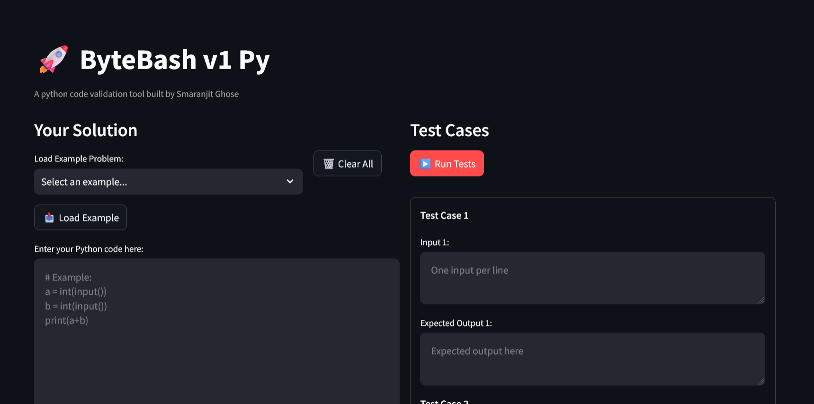

# 🚀 ByteBash


A Python code validation tool for testing and validating coding solutions.



## 📋 Overview

ByteBash is an internal tool designed to help content creators at ByteXL validate Python coding problems before publishing them to students. The platform provides a clean, intuitive interface for testing code against multiple test cases with comprehensive result analysis.

## ✨ Features

- **🎯 Multi-Test Validation**: Test your Python code against 7 comprehensive test cases
- **📚 Example Problems**: Pre-loaded problems categorized by difficulty (Beginner, Intermediate, Advanced)
- **🔄 Real-time Testing**: Instant feedback with pass/fail results and detailed output comparison
- **💾 Session Management**: Automatically saves your work during the session
- **🖥 Scrollable Test Case Panel**: Navigate through all test cases easily with smooth scrolling
- **📝 Flexible Output Matching**: Case-insensitive comparison and automatic whitespace trimming
- **🖱 One-Click Reset**: Clear all code and test cases instantly with a single button

## 🛠️ Installation

### Prerequisites

- Python 3.13 or higher
- [uv](https://docs.astral.sh/uv/) - Fast Python package installer and resolver

### Setup

1. **Clone the repository**
   ```bash
   git clone https://github.com/smaranjitghose/bytebash.git
   cd bytebash
   ```

2. **Install uv (if not already installed)**
   ```bash
   # On macOS and Linux:
   curl -LsSf https://astral.sh/uv/install.sh | sh
   
   # On Windows:
   powershell -c "irm https://astral.sh/uv/install.ps1 | iex"
   
   # Or via pip:
   pip install uv
   ```

3. **Setup environment and install dependencies**
   ```bash
   # Create virtual environment and install dependencies in one command
   uv sync
   ```

4. **Run the application**
   ```bash
   streamlit run main.py
   ```

5. **Access the tool**
   - Open your browser and navigate to `http://localhost:8501`

## 🎮 Usage

### Loading Example Problems

1. Select an example from the dropdown menu:
   - **Beginner**: Sum of Two Numbers
   - **Intermediate**: Even or Odd
   - **Advanced**: Maximum of Three

2. Click "📥 Load Example" to populate the code editor and test cases

### Writing Custom Solutions

1. Enter your Python code in the left panel
2. Define up to 7 test cases with inputs and expected outputs
3. Click "▶️ Run Tests" to validate your solution
4. Review detailed results with pass/fail status

## 📁 Project Structure

```
bytebash/
│
├── .gitignore             # Git ignore file
├── .python-version        # Python version specification
├── main.py                # Main Streamlit application
├── bytexl_logo.png        # ByteXL logo
├── pyproject.toml         # Project configuration and dependencies
├── README.md              # This file
└── uv.lock                # Locked dependency versions
```

## 🤝 Contributing

This is an internal ByteXL tool. For suggestions or improvements:

1. Fork the repository
2. Create a feature branch (`git checkout -b feature/improvement`)
3. Commit your changes (`git commit -am 'Add new feature'`)
4. Push to the branch (`git push origin feature/improvement`)
5. Create a Pull Request

## 👨‍💻 Author

**Smaranjit Ghose**  
Head of Content Strategy, byteXL  
[GitHub](https://github.com/smaranjitghose) | [LinkedIn](https://www.linkedin.com/in/smaranjitghose/)

## 📄 License

This project is licensed under the MIT License - see the [LICENSE](LICENSE) file for details.

## 🚀 Future Enhancements

- [ ] Whitespace-insensitive & multi-line matching
- [ ] Numeric-close comparison (floating point tolerance)
- [ ] Pass/fail badges inline next to each test case
- [ ] Highlight failed outputs in red, passed in green
- [ ] Quick Start button to auto-load & run default example
- [ ] Syntax highlighting, line numbers, auto-indent in code editor
- [ ] Add/remove test cases dynamically
- [ ] Optional auto-run tests on code change
- [ ] Collapsible example descriptions
- [ ] Resizable test case panel
- [ ] Side-by-side diff view for expected vs actual output
- [ ] Execution time tracking per test case
- [ ] Display total runtime & slowest test case
- [ ] Save & load test case sets as JSON
- [ ] Batch run all examples with results dashboard
- [ ] Group test cases (edge cases, performance cases)
- [ ] Tagging system for test cases
- [ ] Timeout handling for infinite loops
- [ ] Basic memory usage reporting
- [ ] Support for multiple programming languages
- [ ] Database integration for test case management
- [ ] User authentication and role-based access

## 🆘 Support

For tool-related queries or issues, contact **Smaranjit Ghose** via Slack or official email.